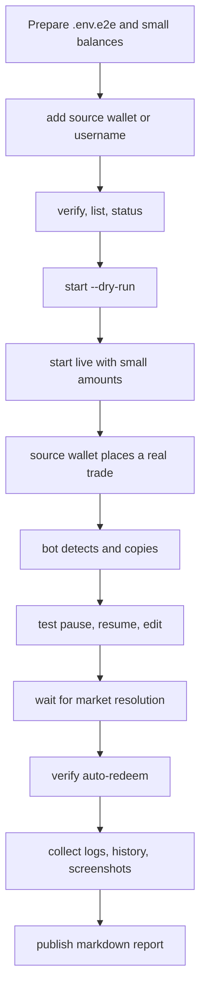

# Testing Workflow

This project uses a three-layer testing workflow:

1. Fast local checks on every change
2. Module regression checks for risky logic changes
3. Release-gated live E2E with small real funds

The goal is simple: catch most regressions before money is involved, then run one realistic end-to-end pass before release.

---

## 1. Fast Local Checks

Run these on every meaningful change:

```bash
npm run typecheck
npm run smoke:commands
npm run smoke:logs
```

What this layer covers:

- TypeScript build safety
- CLI entrypoints still boot
- Read-only operational commands still work
- Log viewing path still works

If your change touches the runtime engine, also run:

```bash
npx tsx src/index.ts start --dry-run --no-dashboard
```

Use `Ctrl+C` after confirming startup, polling, and logging behavior.

---

## 2. Module Regression Checks

Use this layer when changing logic in:

- `src/core/copy-logic.ts`
- `src/core/filters.ts`
- `src/core/executor.ts`
- `src/core/monitor.ts`
- `src/core/redeemer.ts`
- `src/lib/store.ts`
- `src/lib/polymarket-api.ts`

Suggested regression matrix:

| Module | Must verify |
|------|------|
| `copy-logic` | percentage / fixed / range / counter / min amount |
| `filters` | `minTrigger` / `maxOdds` / `maxPerMarket` / `maxDaysOut` / `sellMode` |
| `executor` | dry-run / slippage skip / retry / failure classification |
| `monitor` | polling / dedup / skip vs fail accounting / dashboard events |
| `redeemer` | resolved detection / no-balance skip / dry-run redeem path |
| `store` | read/write safety for addresses / state / history / redeems |

Recommended practice:

- Prefer deterministic fixtures over live APIs
- Separate pure logic checks from network checks
- Keep one failure example for each major failure family

---

## 3. Release-Gated Live E2E

Only run live E2E before release or after risky changes involving:

- order execution
- monitor polling and dedup
- wallet or signer flow
- funder address behavior
- auto-redeem
- dashboard event flow
- Polymarket API integration

### Wallet Setup

Prepare two small test identities:

- `source test wallet`
  - the wallet being followed
  - used to place small real trades manually
- `copy test wallet`
  - the wallet controlled by this repo
  - used to execute real copy trades

Minimum funding:

- small amount of USDC for both wallets
- small amount of MATIC for gas
- a dedicated `.env.e2e` or equivalent config

Never reuse your main production wallet for release testing.

### Live E2E Flow



### Required Live Scenarios

- `BUY -> detect -> copy success`
- one intentional `SKIP` case
- one `pause` / `resume` / `edit` flow
- `status`, `history`, and `logs` consistency check
- one resolved market redeem flow when applicable

### Required Evidence

Before calling a live release test complete, collect:

- `history` output
- `logs --commands`
- `logs --errors`
- engine log excerpt for the tested window
- dashboard screenshots if UI changed
- tx hashes for real copy trades
- tx hashes for redeem actions if auto-redeem was in scope

---

## 4. UI Delivery Rules

Every dashboard or terminal UX change must ship with screenshots and markdown.

### Screenshot Naming

Use the same state IDs as `docs/ui-mockups.md`:

- `A-initializing`
- `B-activity-idle`
- `C-live-events`
- `D-monitor-tab`
- `E-edit-mode`
- `F-paused`
- `G-dry-run`
- `H-auto-redeem`

Recommended file naming:

```text
docs/test-runs/assets/2026-03-06/A-initializing.png
docs/test-runs/assets/2026-03-06/C-live-events.png
docs/test-runs/assets/2026-03-06/H-auto-redeem.png
```

### Delivery Files

- Rolling latest summary: `docs/test-runs/latest.md`
- One report per UI change or release test:
  - `docs/test-runs/YYYY-MM-DD-<topic>.md`

Each report should contain:

1. What changed
2. Which states were captured
3. Test steps
4. Expected result
5. Actual result
6. Known gaps

---

## 5. Release Gate

A risky change is not done until all of these are true:

- `npm run build` passes
- fast local checks pass
- affected commands are smoke-tested
- dry-run path is verified
- UI changes include screenshots and a markdown report
- release-gated changes complete one small live E2E pass
- logs and history prove the result

---

## 6. Suggested Next Infrastructure

These are the next improvements to add over time:

- a real test framework for fixtures and regression cases
- a stable `.env.e2e` workflow
- a reusable small-market checklist
- automated screenshot capture for terminal states
- a CI-safe smoke suite that excludes live trading
